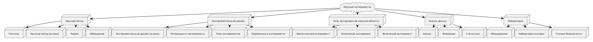
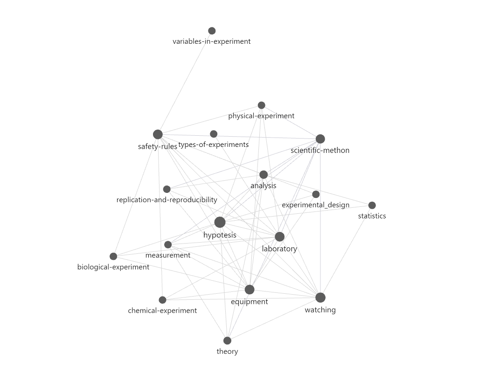

# Отчет по лабораторной работе

## Состав команды

| ФИО                     | Что делал                        |Оценка |
|-------------------------|---------------------------------------
| Круглов Максии Юрьевич  | Генерация текстов, написание скрипта |  |
| Болохов Максим Олегович | Генерация текстов, написание скрипта |  |


## Концептуализация предметной области

В процессе концептуализации мы изучали базы знаний (WikiData, dbpedia).

Мы разбили предметную область "Научные эксперименты" на несколько подтем. Для каждой подтемы сгенерировано 3-4 текста:

* Сбор данных и аналитика
    + Анализ
    + Измерение
    + Статистика
* Виды экспериментов
    + Биологический
    + Химический
    + Физический
* Экспериментальный дизайн
    + Экспериментальный дизайн
    + Репликация и повторяемость экспериментов
    + Типы экспериментов
    + Переменные в эксперименте
* Лаборатория
    + Лаборатория
    + Оборудование
    + Техника безопасности
* Научный метод
    + Научный метод
    + Гипотеза
    + Теория
    + Наблюдение

Онтология:


Граф связей:


## Написание текстов

Тексты были сгенерированы с помощью API LLM Gigachat. Основа промтов: ```Объясняй для 10летних детей```. Была ограничена длина ответа до 10 000 символов.

## Выводы

В ходе работы мы получили опыт работы с API Gigachat, сгенерировали тексты для каждой подтемы, написали парсер ссылок. 

Нам удалось сделать богатую ссылаемость между статьями. Сами тексты получились увлекательными, в них встроены картинки для удержания внимания детей.

Эта лабораторная работа получилась очень увлекательной. Мы испытали много ярких эмоций в ходе работы и получили незабываемый, а главное, полезный опыт в генерации текстов с помощью LLM.
